

    <h1>TDM-UK-Postcode-Hub</h1>
    
<strong>A robust, secure backend solution for managing UK postcode data, user authentication, and role-based access control.</strong>

<h2>✨ Key Features</h2>
<ul>
    <li>🔐 <strong>Secure Authentication:</strong> JWT-based authentication with secure cookie handling.</li>
    <li>👤 <strong>User Management:</strong> Seamless registration, login endpoints, and user-to-role assignment capabilities.</li>
    <li>🛡️ <strong>Role & Access Control:</strong> Comprehensive role management system to control page access and administrative privileges.</li>
    <li>🗄️ <strong>Data Handling:</strong> Integrated database management for user, role, and postcode datasets.</li>
    <li>🔍 <strong>Advanced Logging:</strong> Structured, level-based logging for easier debugging and monitoring.</li>
</ul>

<h2>🛠️ Tech Stack</h2>
<ul>
    <li><strong>Language:</strong> Java</li>
    <li><strong>Framework:</strong> Spring Boot</li>
    <li><strong>Database:</strong> PostgreSQL and Redis</li>
    <li><strong>Security:</strong> JSON Web Tokens (JWT) & Spring Security</li>
    <li><strong>Version Control:</strong> Git & GitHub</li>
</ul>

<h2>🔗 API Endpoints</h2>
<ul>
    <li>🌐 <strong>Public:</strong> No authentication required.</li>
    <li>🔑 <strong>Protected:</strong> Requires valid JWT authentication.</li>
</ul>
<table>
  <thead>
    <tr>
      <th>Access</th>
      <th>Method</th>
      <th>Endpoint</th>
      <th>Description</th>
    </tr>
  </thead>
  <tbody>
    <tr>
      <td>🌐</td>
      <td>GET</td>
      <td><code>/</code></td>
      <td>Root path; handles authentication redirection.</td>
    </tr>
    <tr>
      <td>🌐</td>
      <td>GET</td>
      <td><code>/tdm/home</code></td>
      <td>Redirects to dashboard if authenticated; else displays home page.</td>
    </tr>
    <tr>
      <td>🌐</td>
      <td>POST</td>
      <td><code>/api/login</code></td>
      <td>Authenticates user and sets JWT cookie.</td>
    </tr>
    <tr>
      <td>🌐</td>
      <td>POST</td>
      <td><code>/api/register</code></td>
      <td>Registers a new user account.</td>
    </tr>
    <tr>
      <td>🔑</td>
      <td>POST</td>
      <td><code>/api/logout</code></td>
      <td>Invalidates session and clears authentication.</td>
    </tr>
    <tr>
      <td>🔑</td>
      <td>GET</td>
      <td><code>/api/postcodes/getCurrentUser</code></td>
      <td>Retrieves information for the current user.</td>
    </tr>
    <tr>
      <td>🔑</td>
      <td>GET</td>
      <td><code>/api/postcodes/suggest</code></td>
      <td>Fetches postcode suggestions.</td>
    </tr>
    <tr>
      <td>🔑</td>
      <td>GET</td>
      <td><code>/api/postcodes/searchRoute</code></td>
      <td>Searches for routes using postcode data.</td>
    </tr>
    <tr>
      <td>🔑</td>
      <td>GET</td>
      <td><code>/api/postcodes/searchQuery</code></td>
      <td>Executes search queries against the database.</td>
    </tr>
    <tr>
      <td>🔑</td>
      <td>POST</td>
      <td><code>/api/postcodes/insertOrUpdate</code></td>
      <td>Inserts or updates postcode records.</td>
    </tr>
    <tr>
      <td>🔑</td>
      <td>GET</td>
      <td><code>/api/roles/getAllRolesList</code></td>
      <td>Retrieves a list of all role names.</td>
    </tr>
    <tr>
      <td>🔑</td>
      <td>GET</td>
      <td><code>/api/roles/getRolesPagesList</code></td>
      <td>Retrieves paginated list of roles and page access mappings.</td>
    </tr>
    <tr>
      <td>🔑</td>
      <td>GET</td>
      <td><code>/api/roles/getUsersRolesList</code></td>
      <td>Retrieves user roles with search/keyword filtering and pagination.</td>
    </tr>
    <tr>
      <td>🔑</td>
      <td>POST</td>
      <td><code>/api/roles/createRolePages</code></td>
      <td>Creates a new role with assigned page access permissions.</td>
    </tr>
    <tr>
      <td>🔑</td>
      <td>POST</td>
      <td><code>/api/roles/updateRolePages</code></td>
      <td>Updates an existing role's description and page access URLs.</td>
    </tr>
    <tr>
      <td>🔑</td>
      <td>DELETE</td>
      <td><code>/api/roles/deleteRole</code></td>
      <td>Deletes a specific role by ID.</td>
    </tr>
    <tr>
      <td>🔑</td>
      <td>GET</td>
      <td><code>/api/roles/getRoleUserCount</code></td>
      <td>Gets the total count of users assigned to a specific role.</td>
    </tr>
    <tr>
      <td>🔑</td>
      <td>POST</td>
      <td><code>/api/roles/updateUserRoles</code></td>
      <td>Updates the assigned roles for a specific user.</td>
    </tr>
  </tbody>
</table>

<h2>🚀 Quick Start (Local Setup and Deployment Guide)</h2>

<h3>Prerequisites</h3>

Ensure you have the following installed and running:

<ul>
    <li><strong>JDK 17</strong> or higher</li>
    <li><strong>Maven 3.3.4</strong> or higher</li>
    <li><strong>PostgreSQL 9.15</strong> or higher</li>
    <li><strong>Redis 8.0.5</strong> or higher</li>
</ul>

 

<h3>Part 1: PostgreSQL Database Setup</h3>
<ol>
    <li><strong>Configure Application:</strong> Update your <code>src/main/resources/application.properties</code> with your database credentials:
        <pre><code>spring.datasource.url=jdbc:postgresql://localhost:5432/tdm_database
spring.datasource.username=postgres
spring.datasource.password=admin</code></pre>
    </li>
    <li><strong>Connect Database:</strong> Open your PostgreSQL client (e.g., pgAdmin 4) and connect to <code>tdm_database</code>.</li>
    <li><strong>Data Loading:</strong> Locate the <code>ukpostcodes.csv</code> file provided in your project's <code>/data/</code> directory. Open the Query Tool in your PostgreSQL client and execute the following command (update the path to your project's absolute path):
        <pre><code>COPY postcodes (id, postcode, latitude, longitude)
FROM 'C:\path\to\your\project\TDM-UK-Postcode-Hub\data\ukpostcodes.csv'
DELIMITER ',' CSV HEADER;</code></pre>
    </li>
</ol>

<h3>Part 2: Redis Setup & Testing (WSL)</h3>

If you are using Windows Subsystem for Linux (WSL), install, start, and verify Redis:

<pre><code>#Install and start Redis
sudo apt update
sudo apt install redis-server
sudo service redis-server start
 
#Test connection, connection success will return PONG
redis-cli ping
</code></pre>

<h3>Part 3: Project Setup & Deployment</h3>
<ol>
    <li><strong>Clone the repository:</strong> <code>git clone https://github.com/lestonben/TDM-UK-Postcode-Hub.git</code></li>
    <li><strong>Configure Application Properties:</strong> Update <code>src/main/resources/application.properties</code> with your database credentials.</li>
    <li><strong>Build:</strong> <code>mvn clean install</code></li>
    <li><strong>Run:</strong> <code>mvn spring-boot:run</code></li>
    <li><strong>Open your webpage:</strong> <a href="http://localhost:8081/">http://localhost:8081/</a></li>
</ol>

<h2>📸 System Preview</h2>

<ul>
    <li>
        <strong>Login</strong>
         
        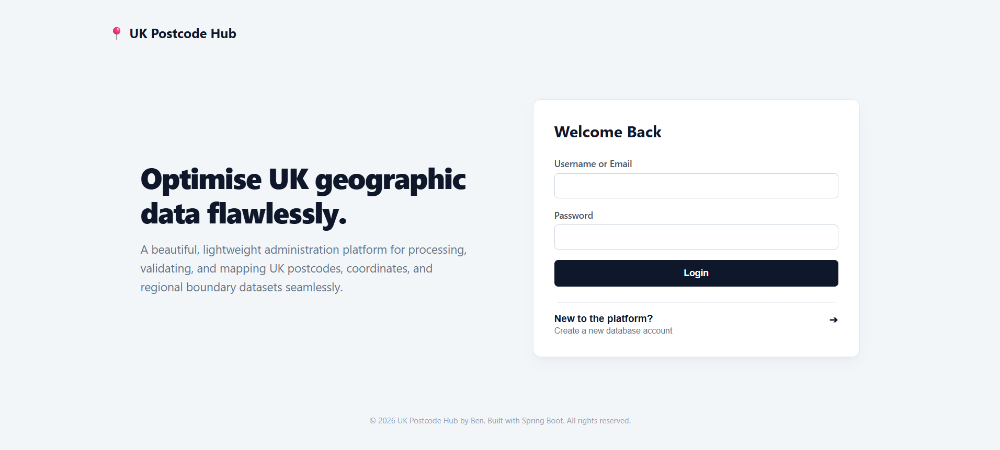
    </li>
    <li>
        <strong>Login/Register with Recaptcha</strong>
         
        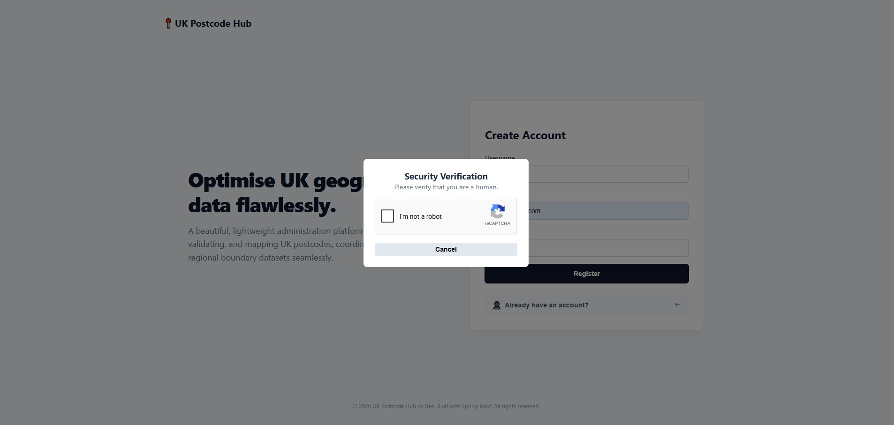
    </li>
     
    <li>
        <strong>Display Postcode Suggestions</strong>
         
        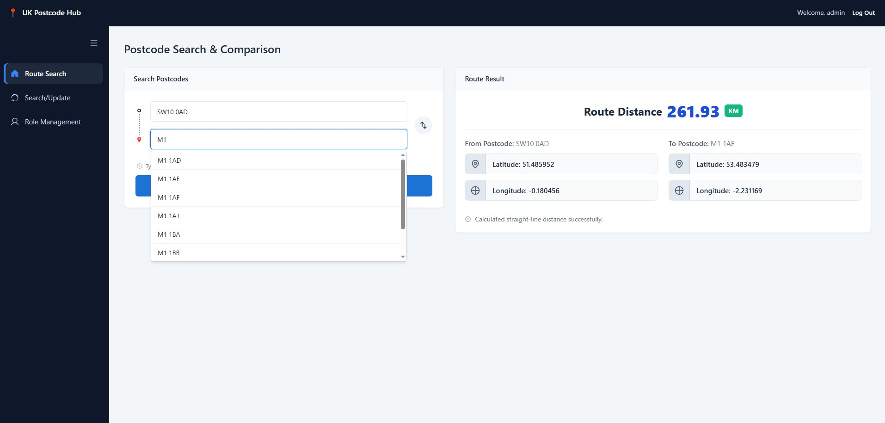
    </li>
     
    <li>
        <strong>Search Route</strong>
         
        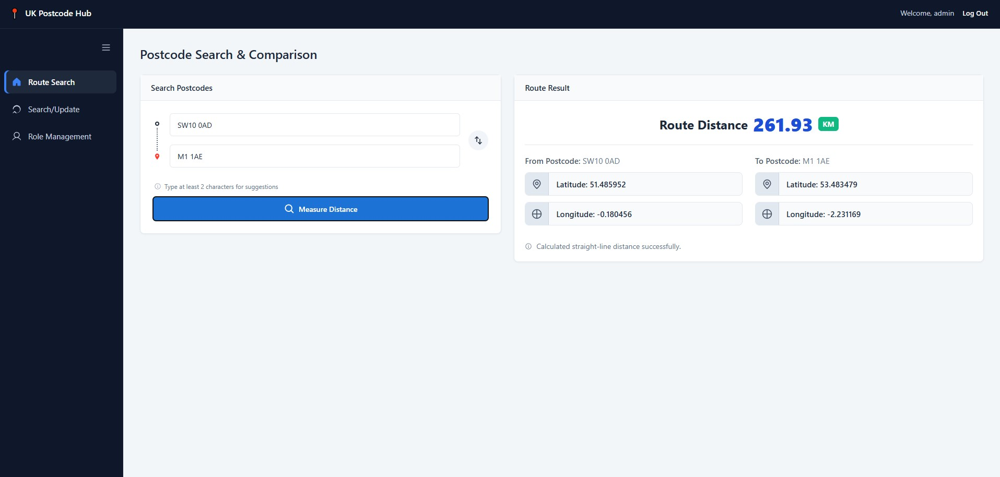
    </li>
     
    <li>
        <strong>Search Postcode Details</strong>
         
        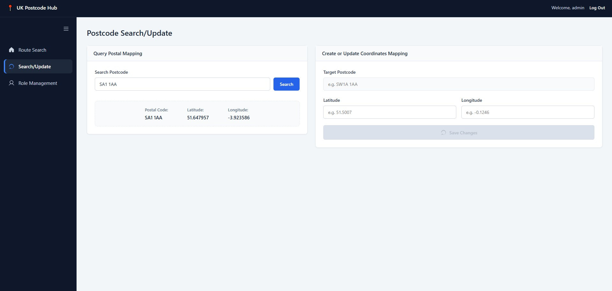
    </li>
     
    <li>
        <strong>Create/Update Postcode Input Validations</strong>
         
        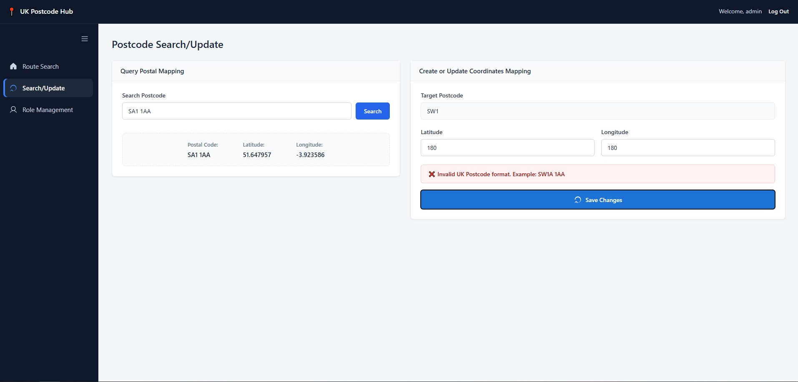
    </li>
     
    <li>
        <strong>Create/Update Postcode Result</strong>
         
        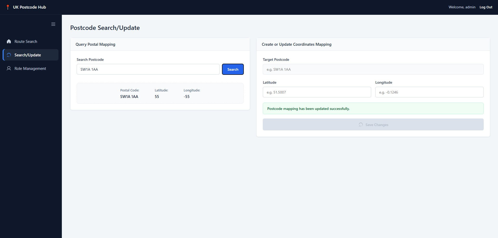
    </li>
     
    <li>
        <strong>User Roles & Access Pages Management</strong>
         
        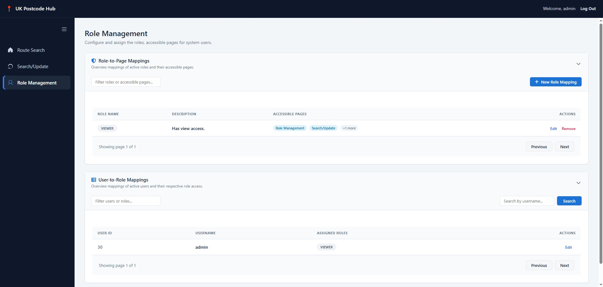
    </li>
     
    <li>
        <strong>Role to Access Pages Update</strong>
         
        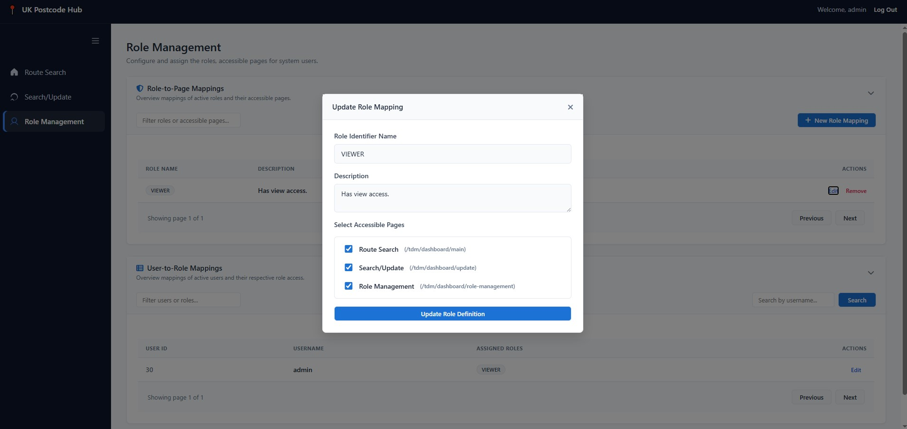
    </li>
     
    <li>
        <strong>User to Roles Update</strong>
         
        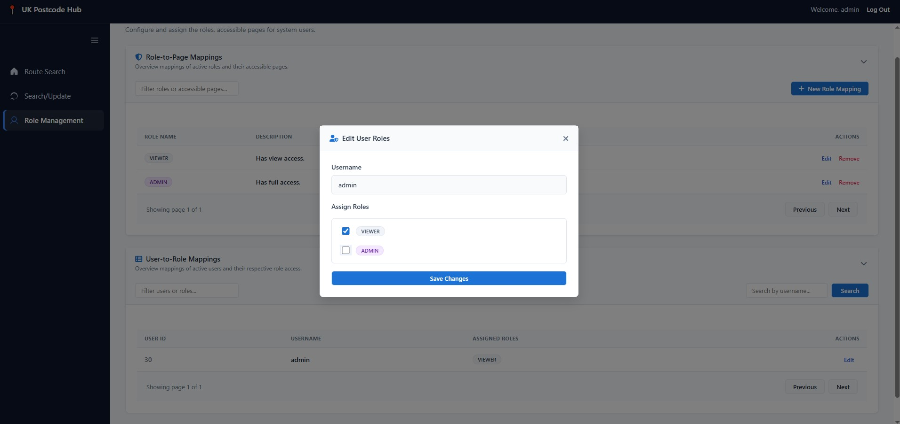
    </li>
     
    <li>
        <strong>Access Denied View</strong>
         
        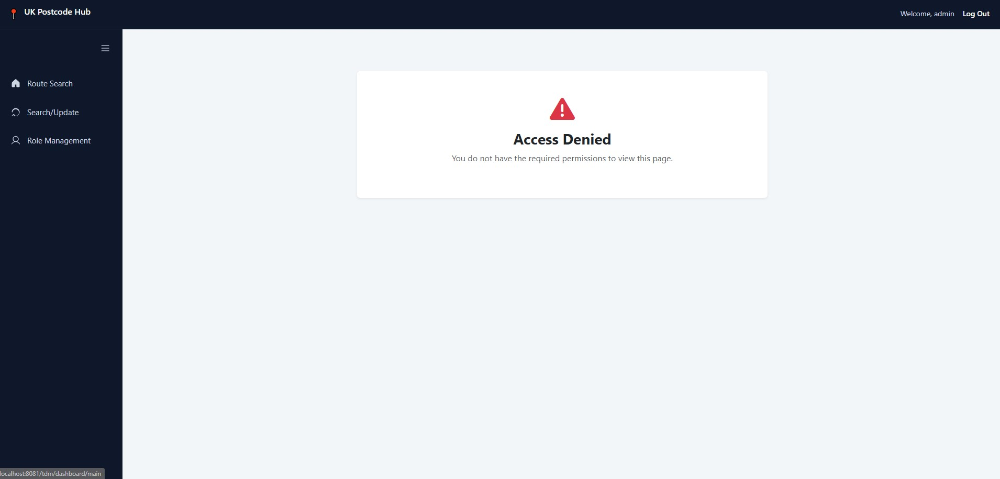
    </li>
</ul>
